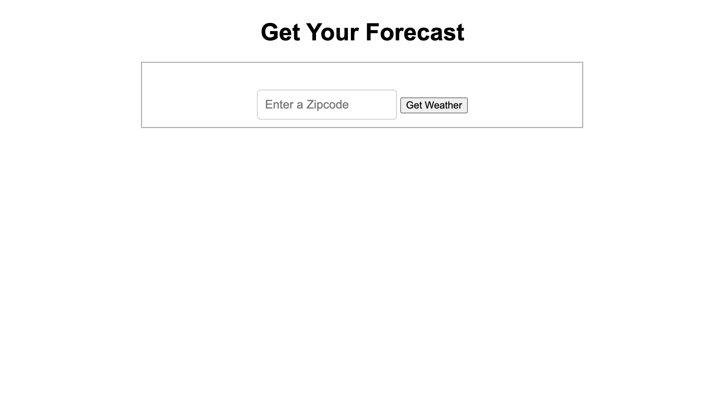

# Weather Forecast App


This is a Node.js-based application that fetches and displays weather forecasts using the OpenWeather API.

## Features
- Fetches current weather data and forecasts
- Uses OpenWeather API for accurate weather information
- Simple and lightweight Node.js backend
- Displays weather conditions in a user-friendly format

## Technologies Used
- [Node.js](https://nodejs.org/)
- [Express](https://expressjs.com/) (if applicable)
- [OpenWeather API](https://openweathermap.org/api)

## Getting Started

### Prerequisites
Ensure you have the following installed:
- Node.js (LTS version recommended)
- npm or yarn


### Environment Variables
Create a `.env` file in the root directory and add the following variables:
```
API_KEY=your_api_key
```
Replace `your_api_key` with your actual OpenWeather API key.

### Running the Application
Start the server with:
```sh
node index.js
# or, if using nodemon
nodemon index.js
```
The application will be available at `http://localhost:8000/` (if using Express).

## Deployment
To deploy the application, use a cloud platform Vercel.

## Contributing
Feel free to fork this repository and submit pull requests for improvements or feature additions.

## License
This project is licensed under the MIT License.

